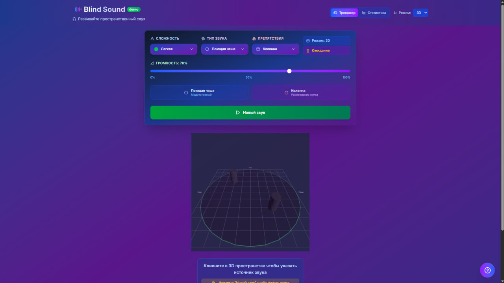
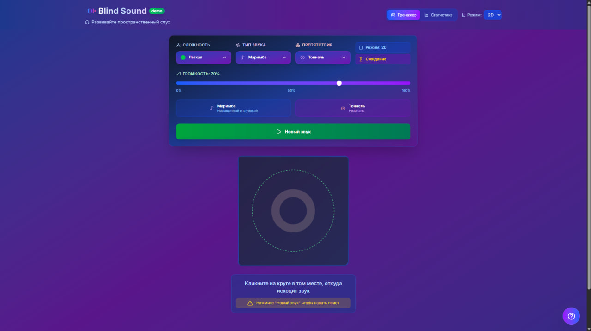
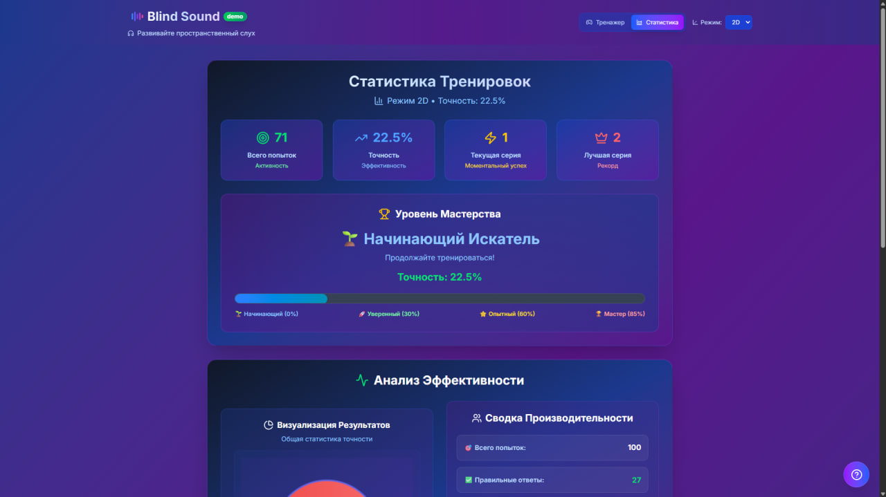
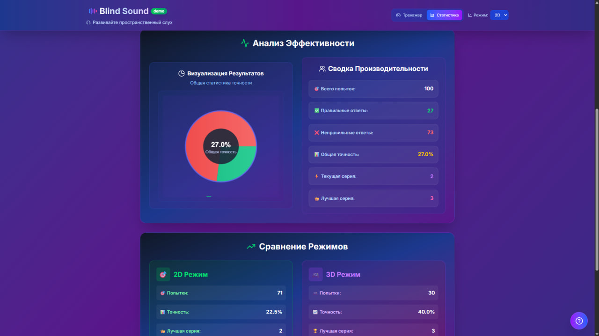

# Blind Sound

<p align="center">
  <b>Train your spatial hearing in a fast, game-like web experience.</b><br/>
  A focused pet project built with Next.js, React, TypeScript, Web Audio API, and Three.js.
</p>

<p align="center">
  
  
  
  
</p>

---

## Demo

You can view the live demo here: [tap here](https://blind-sound-git-main-trylastskys-projects.vercel.app/)

---

## About the project

**Blind Sound** is an interactive hearing trainer where you:

1. Play a sound from a hidden position.
2. Guess where it came from (in 2D or 3D space).
3. Get instant feedback and track your progress.

The goal is to improve spatial hearing and sound-source localization through short, repeatable practice sessions.

---

## Features

- **2D and 3D training modes**
- **Difficulty presets**: Easy / Medium / Hard
- **Sound type selection**
- **Obstacle simulation**: `none`, `wall`, `pillar`, `corner`, `tunnel`, `maze`
- **Volume control**
- **Player statistics**: attempts, accuracy, current streak, best streak
- **Persistent progress** via `localStorage`

---

## Screenshots

### 1) Main training screen (3D mode + controls)

Main app view in 3D mode with mode switch, sound selection, obstacle selection, and round controls.



### 2) 2D training mode

2D mode interface that demonstrates support for multiple training modes.



### 3) Player statistics overview

Overview of player progress and key performance metrics.



### 4) Detailed player statistics

Detailed statistics view for deeper performance analysis.



---

## Tech stack

- **Framework:** Next.js 16 (App Router)
- **UI:** React 19 + Tailwind CSS 4
- **Language:** TypeScript
- **3D:** Three.js
- **Audio:** Web Audio API
- **Icons:** lucide-react

---

## Getting started

### 1) Clone the repository

```bash
git clone https://github.com/yourusername/blind-sound.git
cd blind-sound